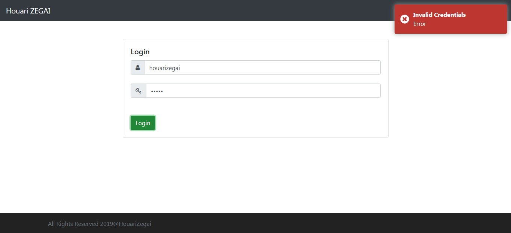
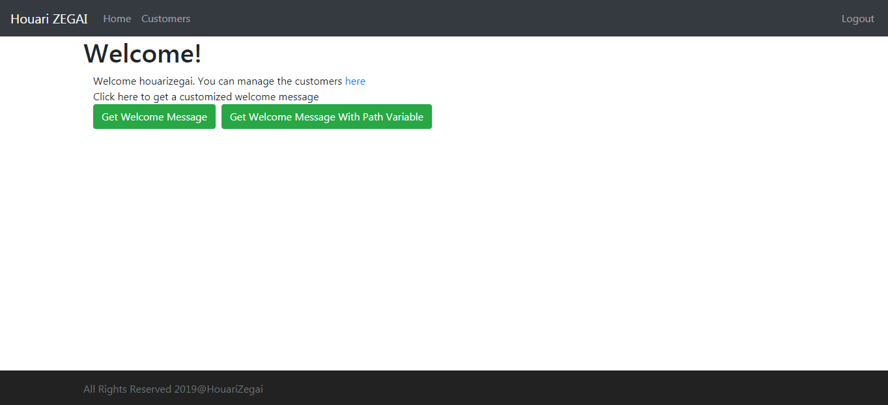
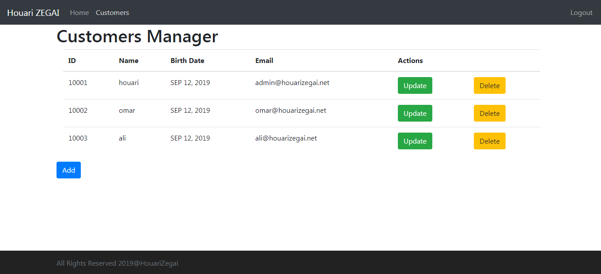
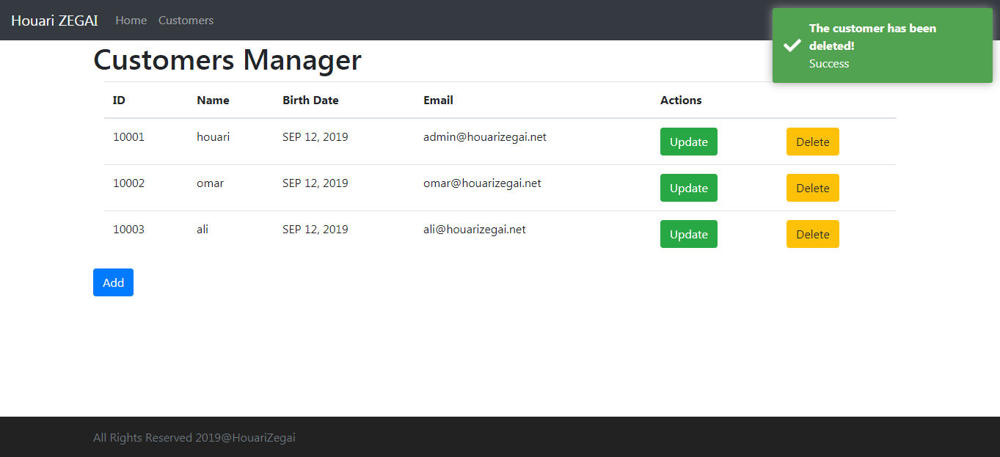

# Customer Relationship Managment (CRUD)
Full-stack Web Application using Angular &amp; SpringBoot (RestFull API).

### Used Technologies & Tools
* Front-end
  * Angular 8.
  * Bootstrap.
* Back-end
  * SpringBoot 2.x.x (Making REST API) [Java 8].
  * Spring Security (Authentication & JWT)
  * Maven

### Screenshots
Login           |
:---------------------:|
|
Home           |
|
Customer Managment           |
|
Add/Update Customer           |
|

### Contributing 💡
If you want to contribute to one of this projects and make it better with new ideas or fixing issues, your pull request is very welcomed.
If you find any issue just put it in the repository issue section, thank you.
